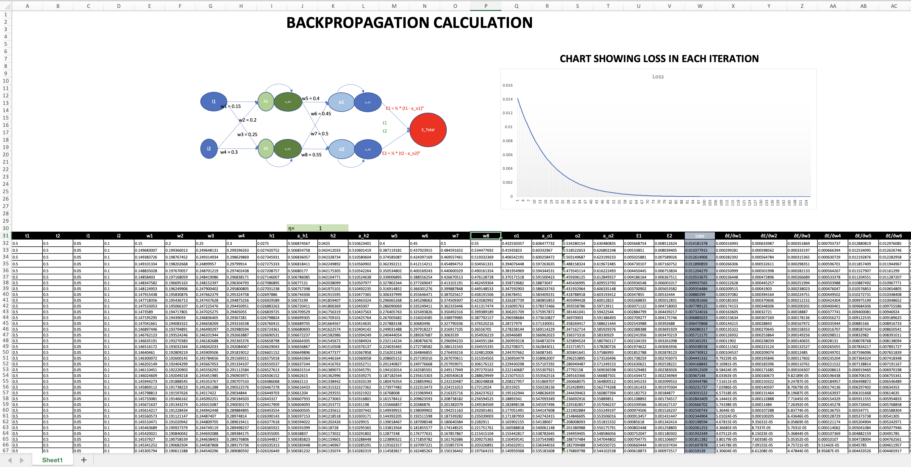

# Backpropagation

This excel provides an overview of a simple feed-forward neural network with three layers: an input layer, a hidden layer, and an output layer. The network uses sigmoid activation functions and a mean squared error loss function. The backpropagation algorithm is used for training.

## Network Architecture

The network consists of the following layers:
* **Input Layer**: This layer has two nodes, i1 and i2
* **Hidden Layer**: This layer has two nodes, represented as h1 and h2 before the application of the sigmoid activation function, and ah1 and ah2 after the application of the sigmoid activation function.
* **Output Layer**: This layer has two nodes, represented as o1 and o2 before the application of the sigmoid activation function, and ao1 and ao2 after the application of the sigmoid activation function.

## Weights
The weights connecting the layers are represented as w1, w2, w3, w4, w5, w6, w7, and w8. The weights are used as follows:

h1 = i1w1 + i2w2  
h2 = i1w3 + i2w4  
o1 = w5a1 + w6ah2  
o2 = w7ah1 + w8ah2  

## Activation Function
The sigmoid function is used as the activation function in the hidden and output layers. After the application of the sigmoid function, the hidden layer nodes are represented as ah1 and ah2, and the output layer nodes are represented as ao1 and ao2.

## Loss Function
The network uses a mean squared error loss function. The targets for the output layer nodes are represented as t1 and t2. The individual errors for the output nodes are calculated as follows:

E1 = 1/2*(t1 - ao1)2
E2 = 1/2*(t2 - ao2)2
The total loss Etot is the sum of E1 and E2.

## Learning Rate

The learning rate is a hyperparameter that determines the step size at each iteration while moving toward a minimum of a loss function. It plays a crucial role in the training of neural networks.
 

1. **Very Small Learning Rate**: If the learning rate is very small, the steps towards the minimum of the loss function will also be very small. This means the network will learn very slowly. While this might lead to a very precise convergence (because it takes small steps and is less likely to overshoot the minimum), it also means that the network will need a lot of time (i.e., many epochs) to converge, which can be computationally expensive. There's also a risk that the learning process gets stuck in a local minimum rather than finding the global minimum.
2. **Extremely Large Learning Rate**: If the learning rate is too large, the steps will also be large. This can cause the learning process to overshoot the minimum of the loss function and potentially result in divergence, meaning the network fails to learn. In the worst case, the loss function could become NaN (Not a Number), a situation known as "exploding gradients". This is usually a sign that the learning rate is too high.

Hence, care must be taken while chosing the learning rate.

<bold> The images showing the effect of change in Loss wrt LR is presnt in repo.</bold>

## Backpropagation

After the forward pass through the network and the calculation of the loss, the backpropagation algorithm is used to update the weights in the network. This involves calculating the derivative of the loss with respect to each weight, and then adjusting the weights in the direction that reduces the loss.

## Backpropagation Calculation

Backpropagation is the method used to update the weights in the network. It involves calculating the partial derivatives of the total error with respect to the weights, and then adjusting the weights in the direction that reduces the error. The following equations are used to calculate these partial derivatives:

* Calculate the partial derivative of the total error with respect to the weights between the hidden and output layers: 
    ∂Etotal/∂w5 = (a01 - t1) * ao1 * (1 -ao1) *  ah1  
    ∂Etotal/∂w6 = (a01 - t1) * ao1 * (1 -ao1) *  ah2  
    ∂Etotal/w7 = (a02 - t2) * ao2 * (1 - ao2) *  ah1  
    ∂Etotal/∂w8 = (a02 - t2) * ao2 * (1 - ao2) *  ah2  

* Calculate the partial derivative of the total error with respect to the outputs of the hidden layer:

    ∂Etotal/∂ah1 = (a01 - t1) * ao1 * (1 - ao1) * w5 +  (a02 - t2) * ao2 * (1 - ao2) * w7  
    ∂Etotal/∂ah2 = (a01 - t1) * ao1 * (1 - ao1) * w6 +  (a02 - t2) * ao2 * (1 - ao2) * w8

* Calculate the partial derivative of the total error with respect to the weights between the input and hidden layers:

    ∂Etotal/∂w1 = ((ao1 - t1) * ao1 * (1 - a01) * w5 +  (ao2 - t2) * ao2 * (1 - ao2) * w7) * ah1 * (1 - ah1) * i1  
    ∂Etotal/∂w2 = ((ao1 - t1) * ao1 * (1 - a01) * w5 +  (ao2 - t2) * ao2 * (1 - ao2) * w7) * ah1 * (1 - ah1) * i2  
    ∂Etotal/∂w3 = ((ao1 - t1) * ao1 * (1 - a01) * w6 +  (ao2 - t2) * ao2 * (1 - ao2) * w8) * ah2 * (1 - ah2) * i1  
    ∂Etotal/∂w4 = ((ao1 - t1) * ao1 * (1 - a01) * w6 +  (ao2 - t2) * ao2 * (1 - ao2) * w8) * ah2 * (1 - ah2) * i2  

These partial derivatives are then used to update the weights in the network. The weights are adjusted in the direction that reduces the total error. This process is repeated for many iterations until the network is adequately trained and the total error is minimized.

